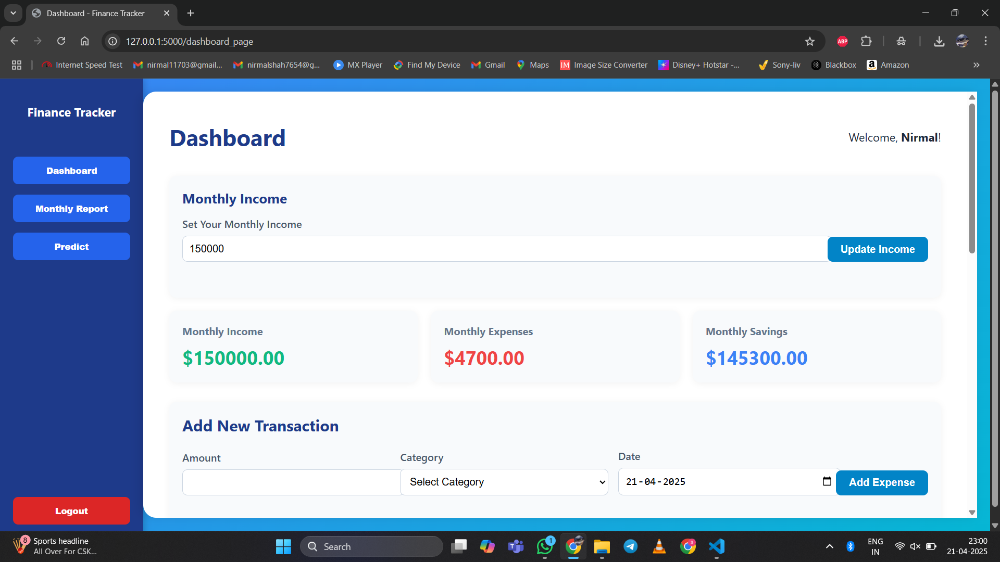

# Personal Finance Tracker

A comprehensive web application to help users track their financial transactions, analyze spending patterns, and make informed budget decisions through interactive visualizations and machine learning predictions.

## Features

### Core Features
- **User Authentication**: Secure registration and login system
- **Dashboard**: Overview of financial status with income, expenses, and savings
- **Transaction Management**: Add, edit, delete, and categorize financial transactions
- **Monthly Reports**: Visualize spending patterns and trends by category
- **ML Predictions**: Forecast future expenses based on historical data

### Technical Features
- **Data Visualization**: Interactive charts for spending analysis
- **Machine Learning**: Predictive models for expense forecasting
- **Responsive Design**: Works on desktop and mobile devices
- **Data Export**: Export your financial data for external analysis

## Tech Stack

- **Backend**: Flask (Python)
- **Database**: SQLite with SQLAlchemy ORM
- **Frontend**: HTML, CSS, JavaScript
- **Machine Learning**: scikit-learn (Gradient Boosting Regressor)
- **Authentication**: Flask session management with password hashing

